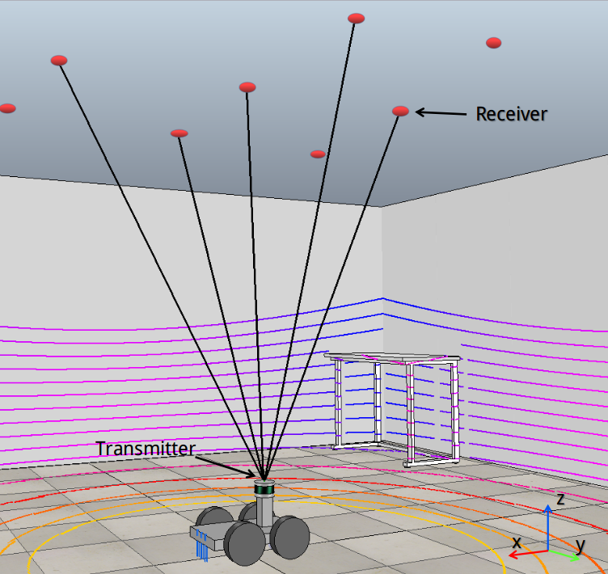
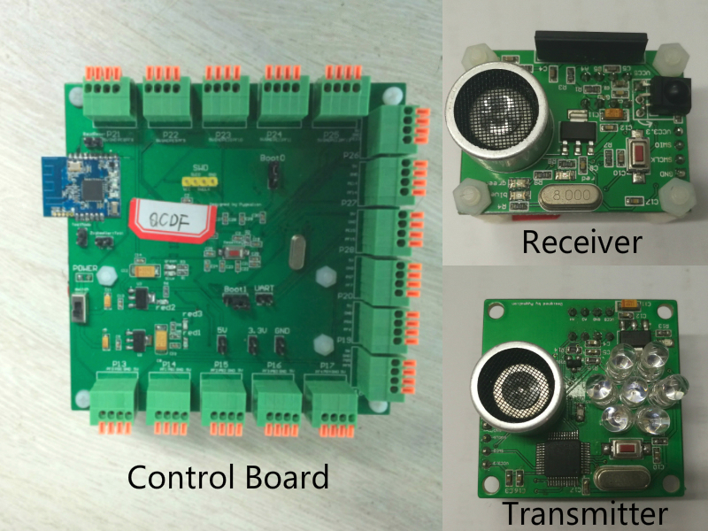

# The Code for paper "Separated Sonar Localization System for Indoor Robot Navigation" 

Our repository includes the simulation code of our paper. The code of the hardware system will be updated later.

## Main contribution:

1. A high precision indoor localization system is designed. The system is convenient to be deployed in a large-scale indoor environment at a very low cost.

2. A novelty convenient calibration method is presented to initialize the localization system in a large-scale environment. The extension for a larger scene is also available.

3. The localization system can work in real-time without accumulative localization error.

4. Each part of the localization system is independent, and the modules of the separated sonar system can be easily replaced.

## Abstract：

This work addresses the task of mobile robot localization for indoor navigation. In this paper, we propose a novel indoor localization system based on separated sonar sensors which can be deployed in large-scale indoor environments conveniently. In our approach, the separated sonar receivers deploy on the top ceiling, and the mobile robot equipped with the separated sonar transmitters navigates in the indoor environment. The distance measurements between the receivers and the transmitters can be obtained in real-time from the control board of receivers with the infrared synchronization. The positions of the mobile robot can be computed without accumulative error. And the proposed localization method can achieve high precision in the indoor localization tasks at a very low cost. We also present a calibration method based on the simultaneous localization and mapping(SLAM) to initialize the positions of our system. To evaluate the feasibility and the dynamic accuracy of the proposed system, we construct our localization system in the Virtual Robot Experimentation Platform(V-REP) simulation platform and deploy this system in a real-world environment. Both the simulation and real-world experiments have demonstrated that our system can achieve centimeter-level accuracy. The localization accuracy of the proposed system is sufficient for robot indoor navigation.

## Simulation Platform：

To validate the proposed localization method and precisely analyze the localization errors, we build the whole localization system in the Virtual Robot Experimentation Platform (V-REP) environment.    (https://www.coppeliarobotics.com/)

## Hardware System:

Our indoor localization system has three different hardware components: the separated sonar receiver, the separated sonar transmitter and the control board of the separated sonar receivers.

## Experiments:

### The PointCloudMap:

## Online Demo：

https://www.bilibili.com/video/BV1Uv411q7ER

